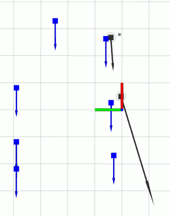
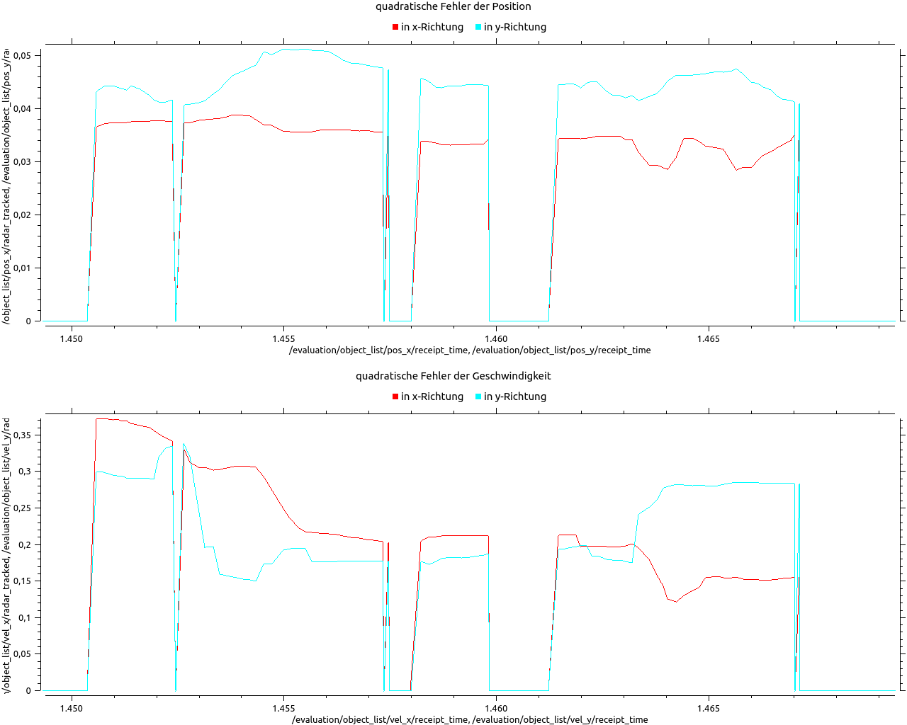
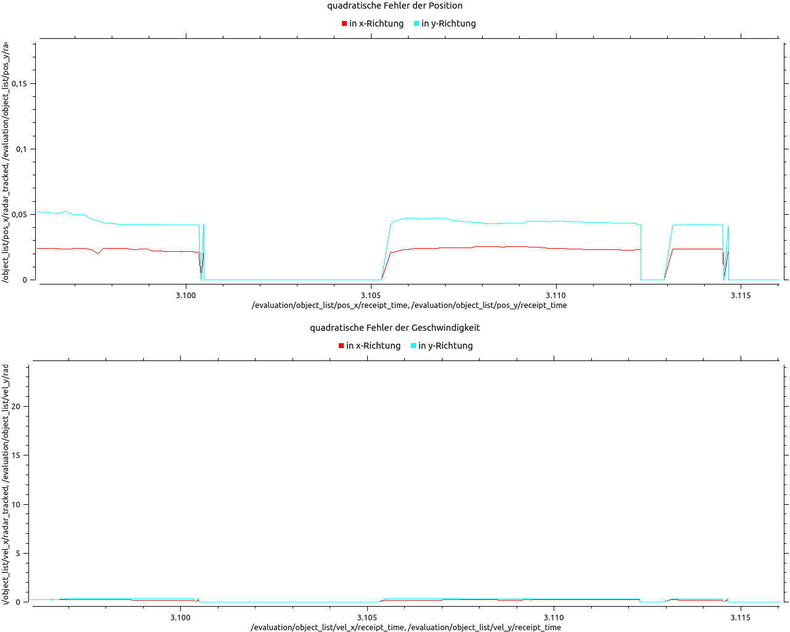
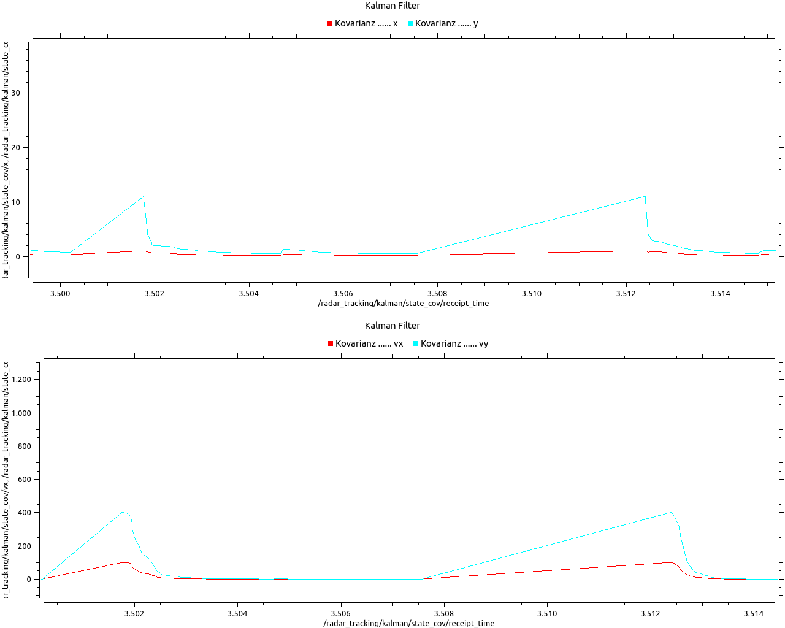
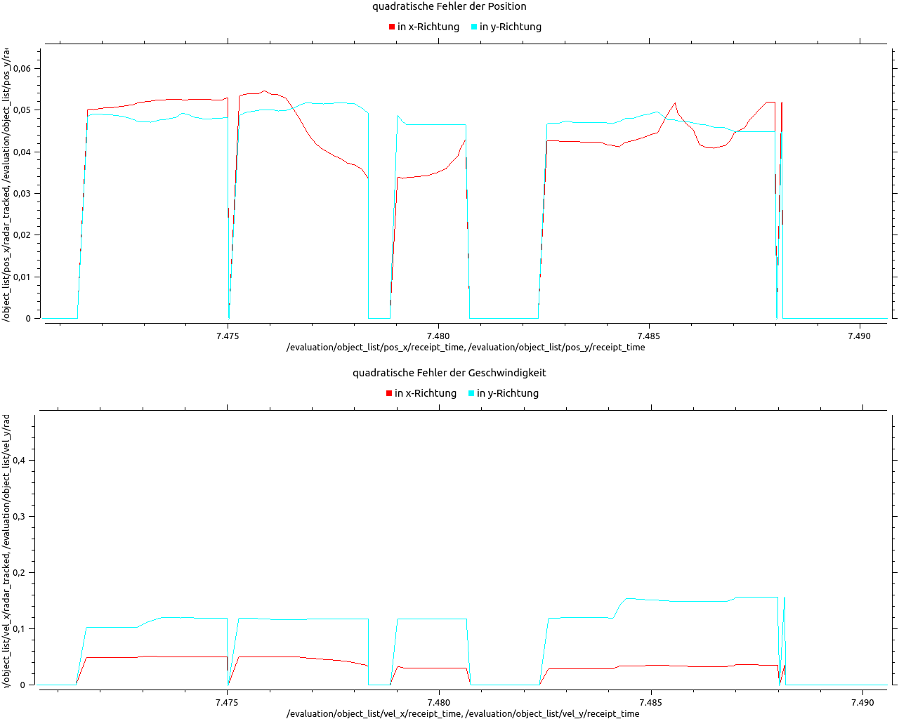

# Multi-Sensor Object Perception for Automated Driving

**Radar Perception, Object Tracking & Sensor Fusion using ROS and Python**

University laboratory project focused on environment perception for automated driving. The project implements a radar-based object tracking pipeline using coordinate transformation, data association, track management and Kalman filtering, followed by an experimental extension toward radar-camera object fusion.

> **Domain:** Automated Driving / ADAS / Environment Perception  
> **Focus:** Radar Tracking, Kalman Filtering, Sensor Fusion, Testing & Evaluation  
> **Technologies:** Python, ROS, NumPy, Gazebo, RViz, rqt_plot / rqt_multiplot

---

## Project Overview

Reliable environment perception is a key requirement for automated driving systems. Sensor measurements are affected by noise and uncertainty and therefore require processing before they can be used for object-level perception.

This project develops and evaluates a radar object tracking pipeline in a simulated ROS environment.

The main processing chain is:

```text
Simulated Radar Measurements
          ↓
Polar-to-Cartesian Transformation
          ↓
Object Association
          ↓
Track Management
          ↓
Kalman Filter Prediction & Update
          ↓
Tracked Object List
          ↓
RViz Visualization & Quantitative Evaluation
```

An additional project stage investigated an architecture for combining radar and camera object measurements in a common object-fusion pipeline.

---

# 1. Radar Perception & Tracking

## 1.1 Radar Measurement Processing

The simulated radar sensor provides object measurements including:

- range
- horizontal angle / azimuth
- radial velocity

The measurements are transformed from polar sensor coordinates into Cartesian coordinates for further object-level processing.

For position:

```text
x = cos(φ) · range
y = sin(φ) · range
```

Radial velocity is approximated in Cartesian components as:

```text
vx = cos(φ) · radial_velocity
vy = sin(φ) · radial_velocity
```

A sensor offset is additionally considered in the implemented tracking node.

**Source code**

- [Radar measurement processing](src/radar_tracking/node_aufgabe_1.py)
- [Final radar tracking node](src/radar_tracking/node.py)

---

## 1.2 Object Association

New radar detections are associated with existing object tracks using a nearest-neighbor approach based on Euclidean position distance.

A gating threshold of:

```text
1.3 m
```

was selected during the laboratory evaluation.

A gate that is too small can create multiple tracks for measurements belonging to the same physical object, while an excessively large gate can incorrectly associate measurements from different objects.

**Source code**

- [Object association implementation](src/radar_tracking/node_aufgabe_1.py)
- [Kalman-filter-based association](src/radar_tracking/node_aufgabe_1_4.py)

---

## 1.3 Track Management

Tracks that do not receive a measurement update are removed after a defined timeout.

The implemented housekeeping threshold is:

```text
0.2 s
```

This prevents outdated object hypotheses from remaining indefinitely in the tracked-object list.

**Source code**

- [Track housekeeping implementation](src/radar_tracking/node_aufgabe_1.py)

---

# 2. Kalman Filter Object Tracking

A constant-velocity Kalman Filter is used to estimate object position and velocity while reducing the influence of noisy radar measurements.

The object state is represented as:

```text
X = [x, y, vx, vy]ᵀ
```

where:

```text
x, y   = object position
vx, vy = object velocity
```

The filter performs the standard recursive estimation sequence:

```text
Previous State
      ↓
Prediction
      ↓
Predicted State & Covariance
      ↓
Radar Measurement
      ↓
Kalman Gain
      ↓
Measurement Update
      ↓
Updated Object State
```

**Source code**

- [Kalman Filter implementation](src/radar_tracking/kalman_filter.py)
- [Radar tracking with Kalman Filter](src/radar_tracking/node_aufgabe_1_4.py)
- [Final tracking node](src/radar_tracking/node.py)

---

## 2.1 Kalman Filter Parameterization

The final implementation uses a four-state constant-velocity model.

Important parameters include:

| Parameter | Value / Description |
|---|---|
| State | `[x, y, vx, vy]ᵀ` |
| Motion model | Constant velocity |
| Association gate | `1.3 m` |
| Track deletion threshold | `0.2 s` |
| Measurement covariance `R` | `diag(2, 4, 2, 4)` |
| Initial covariance `P` | `diag(1, 11, 100, 400)` |
| Process-noise scaling | approximately `0.7` |
| Radar sensor x-offset | `0.25 m` |

The parameters were iteratively adjusted by observing tracking behavior, estimation errors and state covariance.

---

# 3. Visualization

The tracking pipeline was visualized in **RViz**.

The visualization includes object positions, velocity vectors and covariance information, allowing the estimated radar tracks to be compared with the simulated environment.



[View full RViz development workspace](results/radar_tracking_rviz_workspace.png)

---

# 4. Evaluation & Results

Tracking performance was evaluated using squared position and velocity errors in the x and y directions.

The evaluation was performed across multiple stages of the tracking pipeline to observe the effect of Kalman Filter parameterization and the later inclusion of radial-velocity measurements.

## 4.1 Initial Kalman Filter Behavior

The initial Kalman Filter configuration demonstrated object tracking but still showed significant uncertainty, particularly in the velocity states.



The corresponding state covariance development can be viewed here:

[Initial Kalman covariance](results/kalman_covariance_initial.png)

---

## 4.2 Kalman Filter Fine-Tuning

The Kalman Filter parameters were iteratively adjusted to improve the estimated object state.

After tuning, the position error remained low while the velocity estimation became substantially more stable in the evaluated scenario.



The corresponding covariance development:



---

## 4.3 Radial Velocity Extension

In a further development step, the radar radial-velocity measurement was included in the Kalman Filter measurement update.

The measurement model was extended to consider:

```text
Z = [x, y, vx, vy]ᵀ
```

Several parameter configurations were evaluated.

- [Initial velocity-measurement configuration](results/tracking_error_velocity_standard.png)
- [Intermediate velocity-measurement tuning](results/tracking_error_velocity_tuned.png)

Final evaluated configuration:



The experiment showed that directly including the Cartesian approximation of radial velocity did **not automatically improve the tracking result**. In the evaluated configuration, the error increased compared with the tuned position-based Kalman Filter.

This indicates that measurement-model accuracy and sensor-noise parameterization are critical when incorporating radar velocity information.

---

# 5. Radar-Camera Object Fusion

As an extension of the radar tracking pipeline, an object-level sensor-fusion architecture was developed for combining radar and camera object measurements.

The intended processing architecture is:

```text
Radar Object List ─────┐
                       │
                       ▼
                Object Association
                       │
                       ▼
                 Fused Track List
                       ▲
                       │
Camera Object List ────┘
                       │
                       ▼
                Kalman Filtering
                       │
                       ▼
              Fused Object Output
```

The implementation includes:

- radar and camera subscribers
- a shared fused-track list
- object association
- sensor-specific measurement updates
- Kalman Filter prediction and correction structure
- track housekeeping
- covariance visualization

**Source code**

- [Object fusion node](src/object_fusion/node_task_2.py)
- [Fusion Kalman Filter](src/object_fusion/kalman_filter.py)
- [Initial fusion node](src/object_fusion/node.py)

> **Implementation status:**  
> The object-fusion architecture and core processing logic were implemented as an experimental extension. Final Kalman Filter parameterization and quantitative validation of the radar-camera fusion stage were not completed within the laboratory project.

---

# 6. Engineering Findings

Several practical observations were obtained during development and evaluation:

**Data association matters.**  
The gating threshold directly affects track continuity and the risk of incorrect associations.

**Kalman Filter tuning is application-dependent.**  
The process and measurement covariance matrices strongly influence position and velocity estimation.

**Additional measurements do not necessarily improve estimation.**  
Adding radial velocity increased the error in the evaluated configuration, demonstrating the importance of an appropriate measurement model and realistic noise covariance.

**Coordinate transformations must consider vehicle motion.**  
The simple radar velocity transformation does not compensate for ego-vehicle motion, which can lead to differences between estimated track velocity and the actual object-motion direction.

---

# 7. Limitations

The project was developed as a university laboratory implementation in a simulated environment.

Main limitations include:

- constant-velocity object model
- simulated radar measurements and sensor noise
- nearest-neighbor association using a simple Euclidean gate
- no explicit ego-motion compensation in the radar velocity transformation
- no radar clutter or RCS-based filtering
- first-order Cartesian approximation of radial velocity
- no validation using real vehicle sensor data
- radar-camera fusion parameterization was not finalized

These limitations provide clear directions for further development.

---

# 8. Potential Improvements

Possible next steps include:

- Extended Kalman Filter (EKF) or Unscented Kalman Filter (UKF) for nonlinear radar measurement models
- explicit ego-motion compensation
- measurement covariance derived from sensor characteristics
- Hungarian algorithm or Global Nearest Neighbor association
- improved multi-object track management
- radar clutter and false-detection handling
- validation with recorded ROS bag sensor data
- quantitative evaluation of radar-camera fusion
- automated parameter optimization

---

# Repository Structure

```text
radar-perception-tracking/
│
├── src/
│   ├── radar_tracking/
│   │   ├── node.py
│   │   ├── node_aufgabe_1.py
│   │   ├── node_aufgabe_1_4.py
│   │   └── kalman_filter.py
│   │
│   └── object_fusion/
│       ├── node.py
│       ├── node_task_2.py
│       └── kalman_filter.py
│
├── results/
│   ├── radar_tracking_rviz.png
│   ├── radar_tracking_rviz_workspace.png
│   ├── radar_cartesian_error.png
│   ├── tracking_error_initial.png
│   ├── tracking_error_tuned.png
│   ├── kalman_covariance_initial.png
│   ├── kalman_covariance_tuned.png
│   ├── tracking_error_velocity_standard.png
│   ├── tracking_error_velocity_tuned.png
│   └── tracking_error_velocity_final.png
│
└── README.md
```

---

# Technologies & Methods

`Python` · `ROS` · `NumPy` · `Gazebo` · `RViz` · `rqt_plot` · `Kalman Filter` · `Radar Perception` · `Object Tracking` · `Sensor Fusion` · `Data Association`

---

## Project Context

This project was developed as part of the **Automated Driving Lab – Multi-Sensor Environment Perception** at **Ostfalia University of Applied Sciences, Faculty of Automotive Engineering**.

The repository focuses on the technical implementation, evaluation results and engineering findings related to radar-based object perception and the experimental radar-camera fusion extension.
